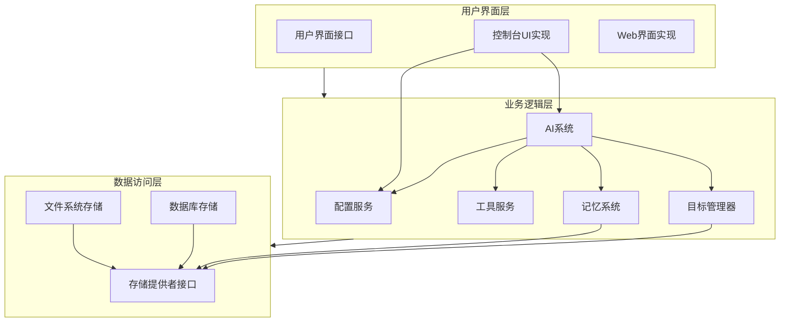
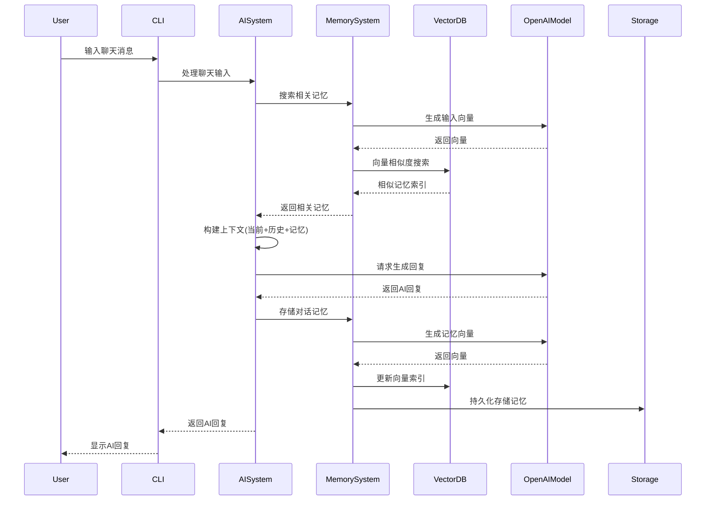
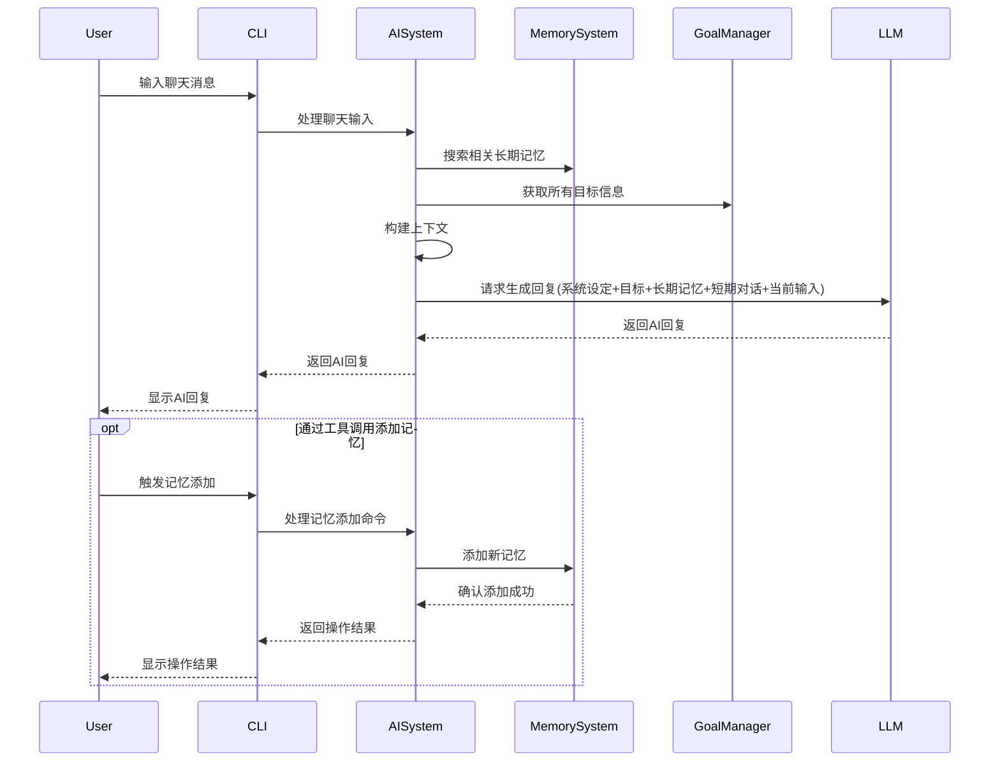

# AI 代理系统架构

## 系统架构图

```mermaid
graph TB
    subgraph Core[核心系统]
        AISystem[AISystem]
        DecisionEngine[DecisionEngine]
        MemoryManager[MemoryManager]
        GoalManager[GoalManager]
    end

    subgraph Storage[存储层]
        FileSystemStorage[FileSystemStorage]
    end

    subgraph Models[模型层]
        OpenAIModel[OpenAIModel]
    end

    subgraph Web[Web服务]
        WebServer[WebServer]
        SocketIO[Socket.IO]
    end

    subgraph CLI[命令行接口]
        CLI[CLI]
    end

    %% 核心系统内部连接
    AISystem --> DecisionEngine
    AISystem --> MemoryManager
    AISystem --> GoalManager

    %% 存储层连接
    MemoryManager --> FileSystemStorage
    GoalManager --> FileSystemStorage

    %% 模型层连接
    AISystem --> OpenAIModel
    MemoryManager --> OpenAIModel
    DecisionEngine --> OpenAIModel

    %% 接口层连接
    WebServer --> AISystem
    SocketIO --> AISystem
    CLI --> AISystem
```

## 系统架构设计

AgentKai系统采用了模块化、分层架构设计，以提高代码复用性、可维护性和扩展性。

### 三层架构

最新版本的AgentKai采用了经典的三层架构模式，将系统划分为：



#### 1. 用户界面层 (UI Layer)

用户界面层负责与用户的交互，处理输入和输出，包括：

- **UserInterface接口**: 定义统一的用户交互方法，如显示消息、获取输入等。
- **ConsoleUI实现**: 为命令行环境提供交互界面。
- **WebUI实现**: 为Web环境提供基于浏览器的交互界面。

#### 2. 业务逻辑层 (Business Logic Layer)

业务逻辑层包含系统的核心功能和业务规则，负责协调各个组件的工作：

- **ConfigService**: 集中管理系统配置，提供统一的配置获取和设置接口。
- **ToolService**: 管理可用工具，处理工具注册和执行。
- **AISystem**: 核心AI协调器，处理用户输入并生成回复。
- **MemorySystem**: 管理系统记忆，包括短期和长期记忆。
- **GoalManager**: 管理系统目标，跟踪目标进度和状态。

#### 3. 数据访问层 (Data Access Layer)

数据访问层处理数据的存储和检索，为上层提供数据服务：

- **StorageProvider接口**: 定义统一的数据存储与检索接口。
- **FileSystemStorage**: 基于文件系统的存储实现。
- **DatabaseStorage**: 基于数据库的存储实现（未来扩展）。

### 核心组件详解

#### ConfigService

ConfigService是一个单例服务，负责管理系统的所有配置项：

- 提供分层配置加载（默认配置 < 包信息 < 环境变量 < 用户配置）
- 封装环境变量访问，避免直接使用process.env
- 提供类型安全的配置获取方法
- 支持配置持久化和重载

配置获取示例：
```typescript
// 获取AI模型配置
const modelConfig = configService.getAIModelConfig();

// 获取数据存储路径
const dataPath = configService.getDataPath();

// 安全访问环境变量
const apiKey = configService.getEnv('AI_API_KEY');
```

#### LoggingMiddleware

LoggingMiddleware提供了一种管理日志输出上下文的便捷方式：

- **withContext**: 创建临时日志上下文
- **withSilentLogs**: 执行时禁用大部分日志输出
- **withUIContext**: 提供UI友好的日志输出
- **withDebugContext**: 临时启用调试日志级别

使用示例：
```typescript
// 执行过程中禁用非关键日志
await LoggingMiddleware.withSilentLogs(async () => {
  // 只显示错误日志的代码
});

// 临时启用调试级别
await LoggingMiddleware.withDebugContext(async () => {
  // 显示更详细日志的代码
});
```

#### 系统适配器 (SystemAdapter)

为支持新旧系统共存和平滑过渡，AgentKai引入了系统适配器模式：

- 封装旧系统接口，提供统一API给新组件
- 处理新旧数据格式的转换
- 确保向后兼容性

这使得系统可以逐步迁移到新架构，而不会破坏现有功能。

### 工具插件系统

新版AgentKai实现了基于插件的工具注册机制：

- **ToolService**: 中心工具注册表
- **ToolPlugin接口**: 插件需实现的接口
- **BasicToolsPlugin**: 基础工具集实现

工具注册示例：
```typescript
// 创建和注册插件
const toolService = ToolService.getInstance();
const basicTools = new BasicToolsPlugin(aiSystem);
toolService.registerTools(basicTools.getTools());
```

### 跨层通信

系统各层之间通过明确定义的接口进行通信：

1. UI层通过接口调用业务层
2. 业务层通过数据访问层接口获取数据
3. 各组件通过事件总线发布/订阅事件（未来扩展）

这种松耦合设计使得各部分可以独立开发和测试，同时确保系统的可扩展性和可维护性。

## 系统组件说明

### 1. 核心系统 (Core)

#### AISystem
- 系统的主要协调者
- 管理决策引擎、记忆管理和目标管理
- 处理用户输入并生成系统响应

#### DecisionEngine
- 负责决策生成
- 使用 LLM 模型进行决策推理
- 维护决策的置信度和推理过程

#### MemoryManager
- 管理系统的长期和短期记忆
- 处理记忆的存储和检索
- 实现记忆的相关性搜索

#### GoalManager
- 管理系统的目标
- 处理目标的创建、更新和完成
- 维护目标之间的依赖关系

### 2. 存储层 (Storage)

#### FileSystemStorage
- 实现文件系统持久化存储
- 管理记忆和目标的存储
- 提供数据读写接口
- 支持向量存储（1024维向量）

### 3. 模型层 (Models)

#### OpenAIModel
- 实现与 OpenAI API 的交互
- 提供文本生成和嵌入生成功能
- 处理模型配置和响应
- 基于阿里云 DashScope 的 Qwen-Max-Latest 模型
- 支持向量嵌入生成（text-embedding-v3）
- 配置项包括：
  - 模型名称：qwen-max-latest
  - API基础URL：https://dashscope.aliyuncs.com/compatible-mode/v1
  - 向量模型：text-embedding-v3
  - 向量API URL：与基础URL相同

### 4. 接口层

#### Web 服务
- 提供 RESTful API
- 实现 WebSocket 实时通信
- 处理 HTTP 请求和响应

#### 命令行接口
- 提供命令行交互界面
- 支持基本的系统操作
- 实现用户输入处理

## 数据流

1. 用户输入通过 Web 接口或 CLI 进入系统
2. AISystem 接收输入并协调各个组件
3. MemoryManager 检索相关记忆
4. GoalManager 获取当前活跃目标
5. DecisionEngine 基于记忆和目标生成决策
6. 系统生成响应并返回给用户

## 配置管理

系统通过统一的配置接口管理各个组件的参数：

- 模型配置 (ModelConfig)
- 记忆配置 (MemoryConfig)
- 决策配置 (DecisionConfig)
- 目标配置 (GoalConfig)

## 扩展性

系统设计支持以下扩展：

1. 新的存储提供者实现
2. 不同的 AI 模型集成
3. 自定义决策策略
4. 新的接口层实现 

## 聊天处理流程详解

聊天是用户与AI代理交互的主要方式，以下是完整的聊天处理链路：



### 聊天流程细节

1. **命令触发**:
   用户通过命令行工具启动聊天：`./node_modules/.bin/ts-node src/cli.ts chat` 或 `npm run chat`

2. **系统初始化**:
   - 创建并初始化AISystem实例
   - 加载历史记忆和重建向量索引
   - 准备短期记忆缓存

3. **用户输入处理**:
   - ChatCommand接收并处理用户输入
   - 将输入传递给AISystem进行处理

4. **记忆检索**:
   - 系统将当前输入转化为向量嵌入
   - 在向量数据库中搜索相似记忆
   - 筛选相似度高于阈值(0.6)的记忆
   - 排序并返回最相关的记忆

5. **上下文构建**:
   - 组合短期记忆(最近对话)
   - 添加检索到的长期记忆
   - 构建完整的对话上下文

6. **生成响应**:
   - 将构建好的上下文和用户输入发送至模型API
   - 调用大语言模型生成回复
   - 处理API错误和重试逻辑

7. **记忆存储**:
   - 将当前对话(用户输入和AI回复)添加到记忆系统
   - 生成向量嵌入并存储
   - 更新向量索引
   - 根据重要性评估可能触发记忆清理
   - 持久化保存记忆数据

8. **响应呈现**:
   - 将AI回复显示给用户
   - 等待下一轮用户输入

### 记忆向量搜索优化

最近对向量搜索部分进行了优化，主要包括：

1. **相似度计算修正**:
   - 将余弦距离(cosine distance)转换为相似度：`similarity = 1 - cosineDistance`
   - 这确保了值越大表示越相似，更符合直觉

2. **阈值调整**:
   - 将相似度阈值从0.3调整为0.6
   - 确保只有真正相关的内容才被返回

3. **日志优化**:
   - 改进了搜索过程的日志输出
   - 增加候选记忆内容预览和相似度显示

这些优化显著提高了记忆检索的准确性和相关性，使系统能够更准确地找到与用户查询相关的历史记忆。

### 对话记忆筛选机制

为了避免记忆系统被大量普通对话填充，新增了对话重要性评估机制：

1. **选择性记忆存储**:
   - 只有重要的对话才会被保存到长期记忆
   - 普通对话仅保留在短期对话历史中

2. **重要性评估标准**:
   - 关键词匹配：包含"记住"、"名字是"等关键词的对话
   - 内容长度：长对话可能包含重要信息
   - 初始对话：系统启动后的前几轮对话

3. **实现方法**:
   - `evaluateConversationImportance` 方法评估对话重要性
   - 基于规则判断是否应该保存为长期记忆
   - 可扩展支持更复杂的重要性评估算法

4. **手动记忆管理**:
   - 用户可以使用特殊命令手动保存重要信息到记忆系统
   - 支持的特殊命令:
     - `!save <内容>`: 将指定内容保存为高优先级记忆
     - `!search <关键词>`: 直接搜索记忆系统
     - `!clear`: 清除当前对话历史，不影响已保存的记忆

这些机制使记忆系统更加高效，只保存真正有价值的信息，降低了记忆混乱和噪声的风险，同时保留了用户对记忆内容的控制能力。

## 系统优化方向

### 聊天流程优化设计

我们对聊天流程进行了重新设计，主要是优化记忆管理和上下文构建方式：



#### 关键优化点

1. **取消自动记忆添加**
   - 不再自动将每次对话添加到长期记忆
   - 记忆添加只能通过以下方式实现：
     - AI主动使用工具调用添加记忆
     - 用户使用特殊命令手动添加记忆
   - 这避免了记忆系统被大量无用信息填充

2. **长期记忆与短期记忆分离**
   - **长期记忆**：存储在记忆系统中，需要向量索引和检索
     - 通过工具调用或手动保存的重要信息
     - 需要长期保存和回忆的知识
   - **短期记忆**：直接保存在对话上下文中
     - 就是最近的对话历史(contextMessages)
     - 不需要向量化或专门搜索
     - 随着对话进行自然流转

3. **目标管理优化**
   - 目标被视为系统的核心驱动力
   - 每次对话都携带所有活跃目标信息
   - 确保AI始终关注并努力实现这些目标
   - 不需要搜索相关目标，全部目标总是可见

4. **上下文构建优化**
   上下文按以下顺序构建：
   1. 系统设定 + AI自身角色定义
   2. 当前所有活跃目标
   3. 相关长期记忆（通过向量搜索获取）
   4. 短期记忆（最近的对话历史）
   5. 用户最新输入

5. **工具使用权限下放**
   - AI可以自主决定何时添加记忆
   - 用户通过特殊命令管理记忆和对话历史
   - 工具执行结果直接反馈给用户

#### 实现调整

1. **AISystem.processInput 方法修改**
   - 移除自动记忆添加逻辑
   - 重构上下文构建过程
   - 添加工具使用结果处理逻辑

2. **Chat命令增强**
   - 添加更丰富的记忆管理命令
   - 改进交互界面
   - 支持短期记忆操作

3. **记忆系统API调整**
   - 调整记忆添加接口，添加类型和来源标记
   - 优化记忆检索算法
   - 添加记忆分类功能

这种设计使系统更像人类记忆工作方式：短期记忆自然流转，重要信息才会被存入长期记忆，目标始终保持关注。AI可以自主决定什么信息值得记住，避免了记忆系统被无价值信息污染。

### 记忆系统增强

1. **记忆组织优化**:
   - 实现记忆聚类和主题识别
   - 添加记忆层级结构，支持记忆概括
   - 开发记忆重要性动态评估算法

2. **记忆检索增强**:
   - 实现混合检索策略(关键词+语义)
   - 添加记忆关联推理能力
   - 支持时间和上下文相关性加权

### 交互体验提升

1. **多模态交互**:
   - 添加图像理解和生成能力
   - 支持语音输入和输出

2. **个性化定制**:
   - 基于用户偏好调整回复风格
   - 学习用户兴趣并主动提供相关信息

### 决策能力强化

1. **自主规划能力**:
   - 开发多步骤任务规划
   - 实现反思和自我校正

2. **工具使用能力**:
   - 集成外部API和工具
   - 开发动态工具选择算法 

## 工具系统架构

### 重构后的工具系统

系统的工具调用机制已经进行了重构，引入了更加解耦的架构设计：

1. **工具管理器 (ToolManager)**
   - 负责工具的注册、查找和执行
   - 提供统一的工具调用接口
   - 支持可扩展的工具调用格式

2. **工具调用格式 (ToolCallFormat)**
   - 将工具调用格式与工具管理逻辑分离
   - 支持自定义工具调用格式和结果处理
   - 默认实现使用`[工具调用]...[/工具调用]`的文本格式

3. **工具接口**
   - 统一的工具定义格式
   - 清晰的参数规范，包括类型、描述和是否必需
   - 支持默认参数值和自动类型转换

### 工具调用流程

1. **工具注册** - 在系统初始化阶段，各类工具（记忆、目标等）注册到工具管理器
2. **上下文构建** - AISystem构建包含工具指南和定义的上下文信息
3. **响应生成** - 生成模型响应，可能包含工具调用
4. **工具调用解析** - ToolManager解析响应中的工具调用
5. **工具执行** - 执行对应的工具处理程序
6. **结果处理** - 格式化工具执行结果并替换到原始响应中

### 优势

1. **低耦合** - 工具管理、调用格式和执行逻辑彼此解耦
2. **可扩展性** - 易于添加新工具和自定义工具调用格式
3. **统一错误处理** - 集中的工具执行错误处理机制
4. **灵活的参数处理** - 支持参数验证、默认值和类型转换
5. **可测试性** - 各组件可独立测试，提高代码质量

### 示例：添加新工具

要添加新工具，只需创建符合Tool接口的工具定义并注册到ToolManager：

```typescript
const myTool: Tool = {
    id: 'my_tool',
    name: '我的工具',
    description: '这是一个示例工具',
    category: 'other',
    parameters: [
        {
            name: 'param1',
            type: 'string',
            description: '参数1',
            required: true
        }
    ],
    handler: async (params) => {
        // 工具实现逻辑
        return { message: `处理了参数: ${params.param1}` };
    }
};

// 注册工具
toolManager.registerTool(myTool);
``` 